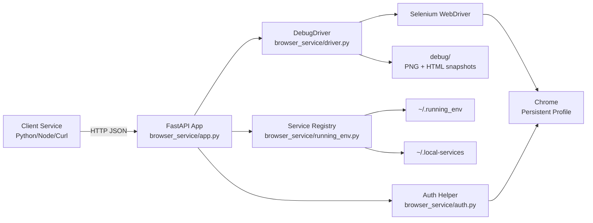
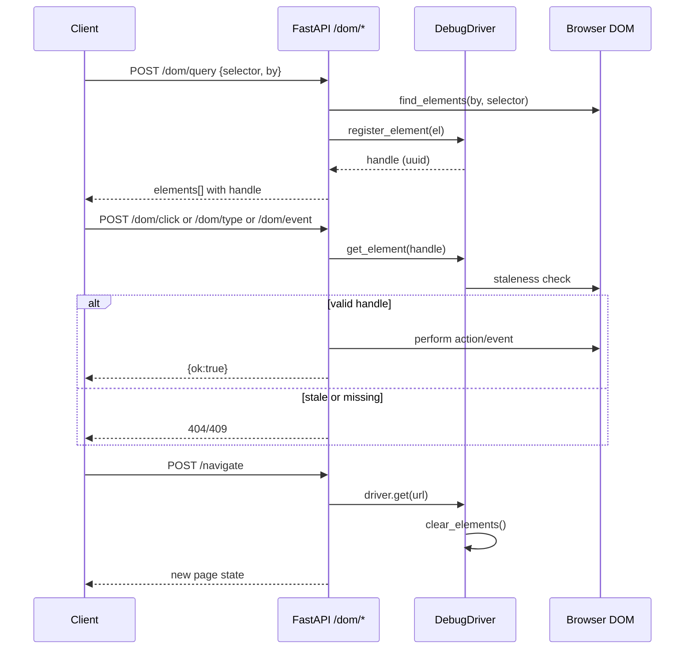

# Architecture

## High-level view

## DOM handle architecture

## Runtime lifecycle

1. Startup
   - App creates one long-lived DebugDriver instance.
   - In connect mode, app attaches to a detached Chrome through DevTools port.
   - Optional auth warmup runs when BROWSER_TARGET_URL is provided.

2. Service registration
   - Endpoint is registered in ~/.running_env with key browser_service.
   - Restart command is written to ~/.local-services.

3. Request handling
   - FastAPI endpoints delegate browser actions to DebugDriver.
   - DOM endpoints optionally issue and reuse in-memory element handles.

4. Shutdown
   - Service deregisters from ~/.running_env.
   - In connect mode, Chrome stays alive.
   - In launch mode, browser is closed with the service.

## Module responsibilities

- browser_service/app.py
  - API schema and endpoint contracts
  - input validation
  - translating Selenium exceptions into HTTP errors

- browser_service/driver.py
  - Chrome startup/attachment
  - frame tracking
  - debug snapshots
  - element handle registry and stale checks

- browser_service/auth.py
  - startup authentication heuristic
  - optional login callback support
  - interactive MFA wait loop

- browser_service/running_env.py
  - endpoint registration/discovery
  - port conflict resolution
  - dependency health checking

- browser_service/timing.py
  - lightweight timing decorators and context manager

## Design decisions

- Persistent browser profile to preserve auth/session state.
- In-memory element handles for convenience and speed.
- Handle invalidation on navigation to prevent unsafe stale reuse.
- Registry files for local service discovery across cooperating tools.
